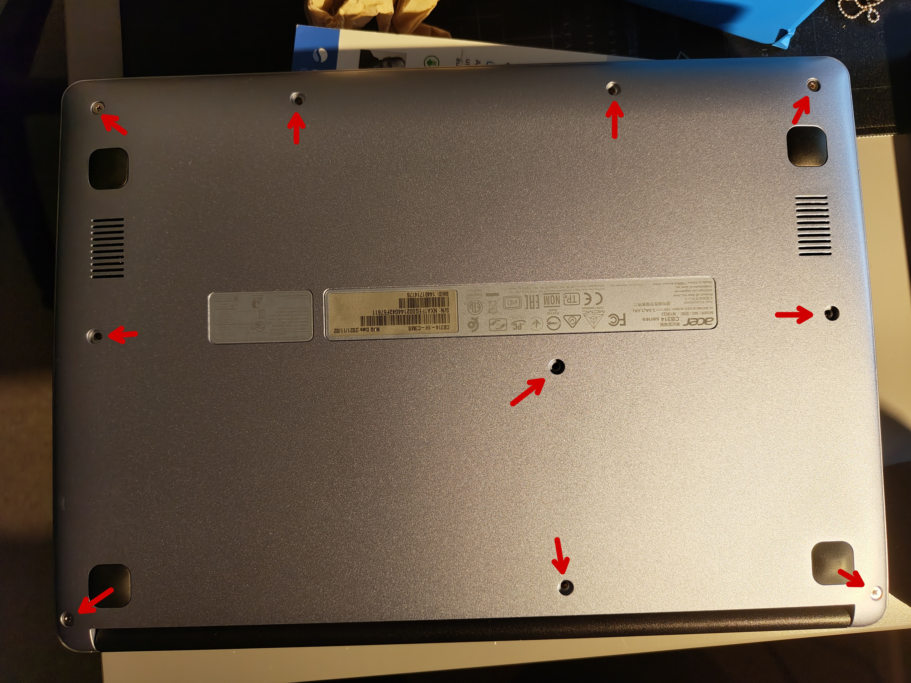
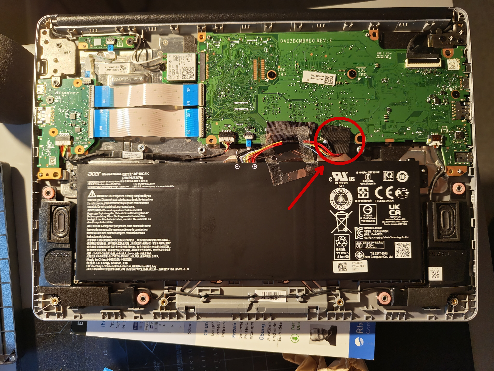
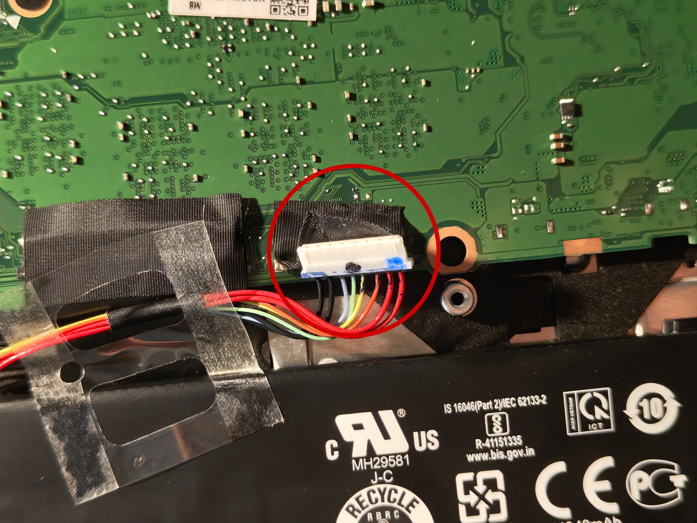

import { Steps } from '@astrojs/starlight/components';

Diese Anleitung ist für das Acer Chromebook 314. Sie enthält Tutorials und Verweise auf Tools zur Installation von Linux auf dem Gerät. Das spezifische Modell, das ich verwende, ist das Acer Chromebook 314-1H-C3M8. Es könnte einige Unterschiede zwischen diesem Modell und anderen Modellen des Acer Chromebook 314 geben, beachten Sie dies bitte.

## Entwicklermodus aktivieren

Dies ist notwendig, um Linux auf dem Gerät zu installieren. **Beachten Sie, dass dabei alle lokalen Daten auf dem Chromebook gelöscht werden, sichern Sie daher alle wichtigen Daten, bevor Sie fortfahren.** Außerdem hat es keine vollständige UEFI-Unterstützung und zeigt bei jedem Start des Chromebooks einen Warnbildschirm an. Um diesen Warnbildschirm zu überspringen, drücken Sie einfach `Strg + D`.

<Steps>
1. Schalten Sie das Chromebook aus.
2. Halten Sie die Tasten `Esc` und `Aktualisieren` gleichzeitig gedrückt und drücken Sie dann die `Ein/Aus-Taste`.
3. Wenn das Chromebook startet, sollte ein Wiederherstellungsbildschirm erscheinen. Drücken Sie `Strg + D`, um den Entwicklermodus zu aktivieren.
4. Bestätigen Sie dies mit `ENTER`. Das Chromebook wird neu gestartet und den Entwicklermodus aktivieren. **Dabei werden alle lokalen Daten gelöscht, stellen Sie sicher, dass Sie wichtige Daten gesichert haben.**
5. Das Chromebook startet im Entwicklermodus neu. Sie werden bei jedem Start des Chromebooks einen Warnbildschirm sehen. Um diesen zu überspringen, drücken Sie einfach `Strg + D`.
6. Richten Sie das Chromebook wie gewohnt ein.
</Steps>

## Von USB booten

**Hierfür muss der Entwicklermodus aktiviert sein**

Zunächst müssen Sie das Booten von USB aktivieren:
<Steps>
1. Drücken Sie die Tasten `Strg + Alt + F2 (Pfeil nach rechts)`, um ein Terminal zu öffnen.
2. Geben Sie `shell` ein und drücken Sie `ENTER`.
3. Geben Sie `sudo crossystem dev_boot_usb=1 dev_boot_legacy=1` ein und drücken Sie `ENTER`.
4. Sie können nun mit `Strg + Alt + F1 (Pfeil nach links)` zu Chrome OS zurückkehren.
</Steps>

Jetzt können Sie von USB booten:
<Steps>
1. Starten Sie Ihr Chromebook neu.
2. Wenn der Warnbildschirm erscheint, drücken Sie `Strg + U` zum Booten von USB. (drücken Sie `Strg + L` für Legacy-Boot)
3. Sie können nun von USB booten.
</Steps>

## BIOS-Schreibschutz deaktivieren

Hierfür muss der Entwicklermodus aktiviert sein. Dies ist nur erforderlich, wenn Sie eine benutzerdefinierte Firmware flashen möchten. Sie benötigen einen Schraubendreher, um das Chromebook zu öffnen. Wenn Sie ein IFixit-Kit haben, können Sie den PH0-Kopf und den Schlitz 2 oder ein Plastik-Öffnungswerkzeug zum Öffnen der Clips im Inneren verwenden.

<Steps>
1. Schalten Sie das Chromebook aus.
2. Öffnen Sie das Chromebook, indem Sie die Schrauben an der Unterseite entfernen. Öffnen Sie dann vorsichtig die Clips im Inneren. 
3. Trennen Sie den Akku vom Motherboard.  
4. Starten Sie nun das Chromebook mit getrenntem Akku. Jetzt sollte der Schreibschutz deaktiviert sein.
</Steps>

Wenn es nicht funktioniert hat, finden Sie weitere Methoden auf [MrChromebox.tech](https://docs.mrchromebox.tech/docs/firmware/wp/disabling.html).

## Vollständige ROM UEFI-Firmware (von MrChromebox)

**Nach dem Flashen können Sie ChromeOS nicht mehr booten**

Stellen Sie vor dem Start sicher, dass Ihr Gerät unterstützt wird. Gehen Sie dazu auf [MrChromebox.tech](https://mrchromebox.tech/#devices) und überprüfen Sie, ob Ihr Gerät unterstützt wird.

Stellen Sie außerdem sicher, dass der Schreibschutz deaktiviert ist. Wenn Sie dies noch nicht getan haben, folgen Sie den Schritten im vorherigen Abschnitt.

<Steps>
1. Öffnen Sie Ihr Terminal mit `Strg + Alt + F2 (Pfeil nach rechts)` oder `Strg + Alt + T`.
2. Geben Sie `shell` ein und drücken Sie `ENTER`.
3. Nun müssen Sie das Skript herunterladen. Geben Sie `cd; sudo bash <(curl -s https://mrchromebox.tech/firmware-util.sh)` ein und drücken Sie `ENTER`.
4. Wählen Sie die zweite Option, `Install/Update UEFI Firmware`.
5. (optional, aber empfohlen) Bestätigen Sie die Sicherung der Original-Firmware und folgen Sie den angezeigten Anweisungen.
6. Nachdem der Flash-Vorgang abgeschlossen ist und keine Fehler oder weitere Anweisungen aufgetreten sind, können Sie Ihr Chromebook neu starten.
7. Installieren Sie Ihr gewünschtes Betriebssystem. Dieser Schritt ist notwendig, da Sie ChromeOS nicht mehr booten können.
</Steps>

## Referenzen

 - [MrChromebox.tech](https://mrchromebox.tech/)
 - [WikiHow](https://www.wikihow.com/Enable-USB-Booting-on-Chromebook)