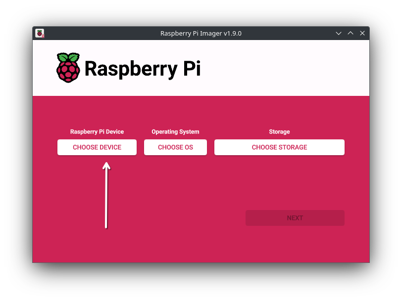
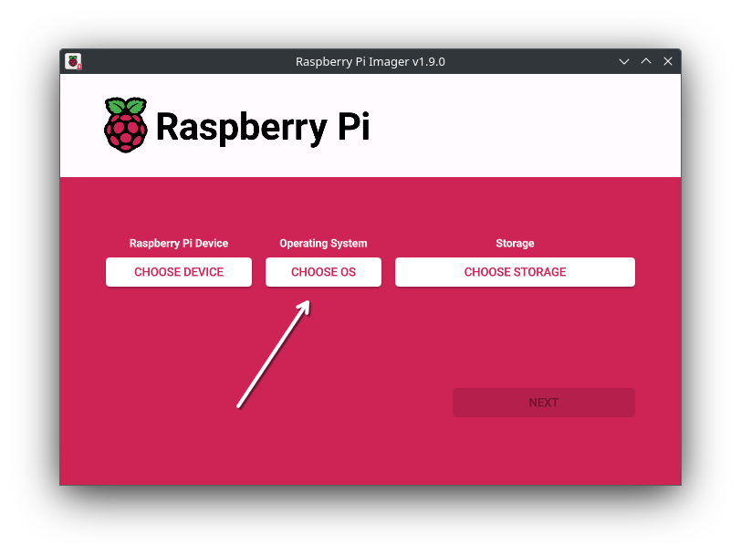
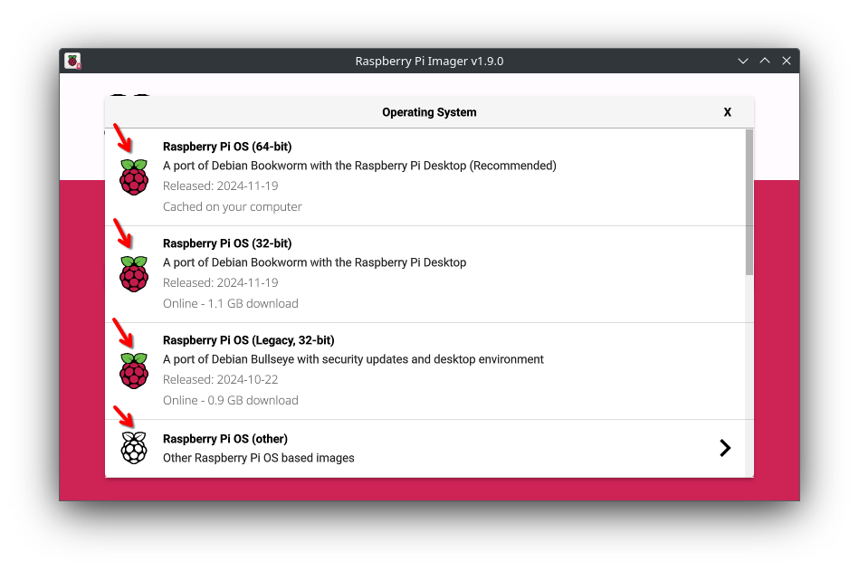
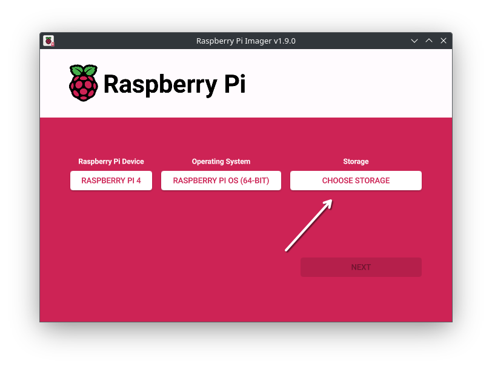
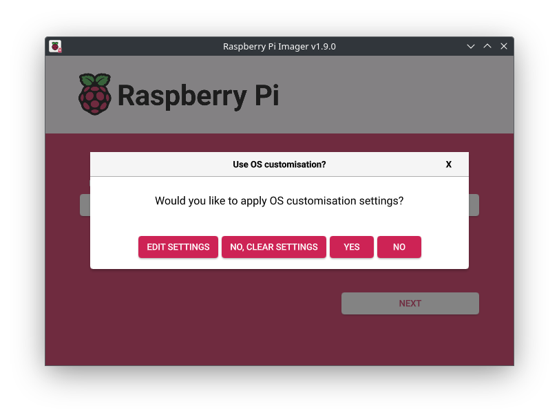

import { Steps } from '@astrojs/starlight/components';

Diese Anleitung funktioniert mit jedem *offiziellen* Raspberry Pi. Diese Anleitung verwendet den offiziellen RPi Imager!

## Voraussetzungen
 - ein Raspberry Pi
 - eine SD-Karte, USB-SSD oder ein USB-Stick (darauf wird das Betriebssystem installiert)
 - (ein Lesegerät falls erforderlich)
 - Raspberry Pi Imager auf einem Computer

## Installation
<Steps>
1. Schließen Sie Ihren Speicher an

2. Öffnen Sie den RPi Imager

3. Wählen Sie Ihr Raspberry Pi Modell aus
   

4. Wählen Sie eine der Raspberry Pi OS Varianten
   
   

5. Wählen Sie Ihr Speichergerät aus
   

6. Klicken Sie auf Weiter

7. Wenn Sie vordefinierte Einstellungen festlegen möchten (Tastatur, WLAN, SSH, ...), können Sie diese hier bearbeiten. Drücken Sie dann einfach "Ja"
   

8. Nachdem der Flash-Vorgang abgeschlossen ist, können Sie Ihren Pi starten und den Einrichtungsassistenten verwenden, falls die OS-Variante dies erfordert
</Steps>