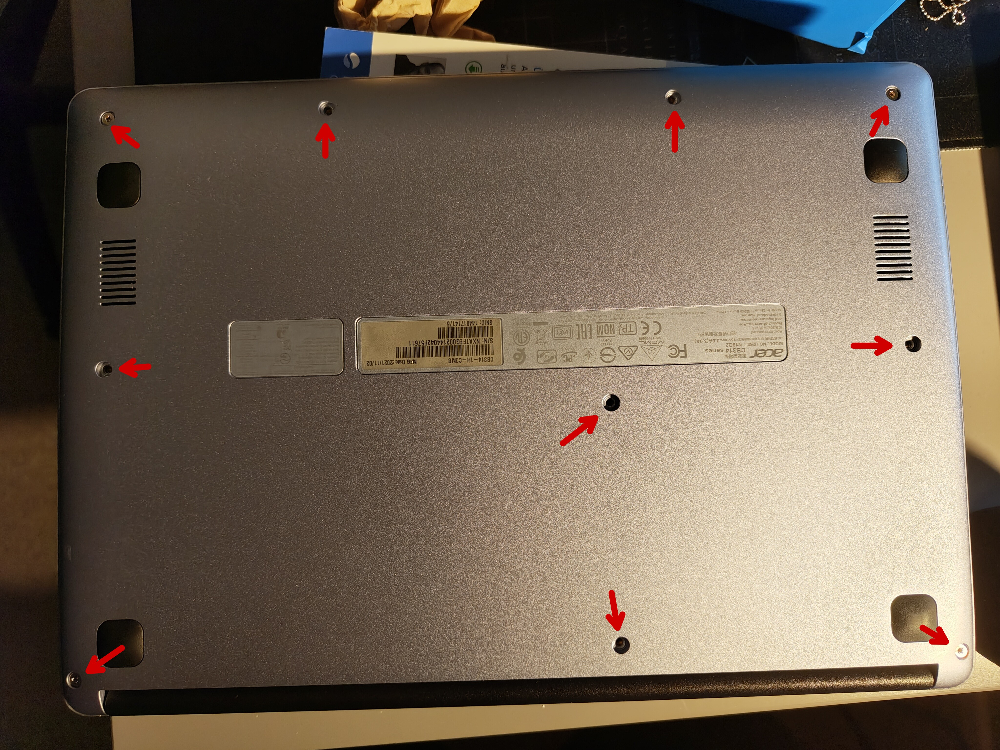
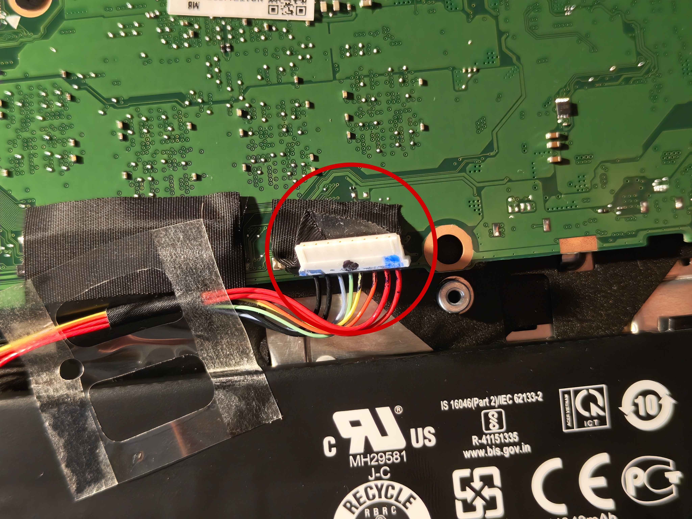

import { Steps } from '@astrojs/starlight/components';

This guide is for the Acer Chromebook 314. It will contain tutorials and references to tools for installing Linux on the device. The specific model that I'm using is the Acer Chromebook 314-1H-C3M8. There might be some differences between this model and other models of the Acer Chromebook 314, so be aware of that.

## Enabling Developer Mode

This is necessary to install Linux on the device. **Be aware that this will wipe all local data on the Chromebook, so make sure to back up anything important before proceeding.** Also, it doesn't have fully support UEFI, and will show a warning screen every time you boot up the Chromebook. To skip this warning screen, just press `Ctrl + D`.

<Steps>
1. Turn off the Chromebook.
2. Press and hold the `Esc` and `Refresh` keys together, then press the `Power` button.
3. When the Chromebook starts up, there should be a recovery screen. Press `Ctrl + D` to enable Developer Mode.
4. Confirm this using `ENTER`. The Chromebook will reboot and enable Developer Mode. **This will wipe all local data, so make sure to back up anything important.**
5. The Chromebook will reboot into Developer Mode. You'll see a warning screen every time you boot up the Chromebook. To skip this warning screen, just press `Ctrl + D`.
6. Set up the Chromebook as you would normally.
</Steps>

## Boot from USB

**For this, you have to have the developer mode enabled**

First you have to enable USB booting:
<Steps>
1. Press the keys `Ctrl + Alt + F2 (right-pointing arrow)` to open a terminal.
2. Type in `shell` and press `ENTER`.
3. Type in `sudo crossystem dev_boot_usb=1 dev_boot_legacy=1` and press `ENTER`.
4. You can now go back to the Chrome OS by pressing `Ctrl + Alt + F1 (left-pointing arrow)`.
</Steps>

Now you can boot from USB:
<Steps>
1. Reboot your Chromebook.
2. When the warning screen appears, press `Ctrl + U` to boot from USB. (press `Ctrl + L` for legacy boot)
3. You can now boot from USB.
</Steps>

## Disable BIOS Write Protection

For this, the developer mode has to be enabled. This is only needed if you want to flash a custom firmware. You'll need a screwdriver to open the Chromebook. If you have a IFixit kit, you can use the PH0 head, and the slotted 2 or a plastic opening tool for opening the clips inside.

<Steps>
1. Turn off the Chromebook.
2. Open the Chromebook by removing the screws on the bottom. And then carefully open the clips inside. 
3. Disconnect the battery from the motherboard.  
4. Now boot up the Chromebook with the battery disconnected. Now the write protection should be disabled.   
</Steps>

If it didn't work, you can see more methods on [MrChromebox.tech](https://docs.mrchromebox.tech/docs/firmware/wp/disabling.html).

## Full ROM UEFI Firmware (by MrChromebox)

**After the flash, you can not boot ChromeOS anymore**

Before you start, please make sure that your device is supported. For this, go to [MrChromebox.tech](https://mrchromebox.tech/#devices) and check if your device is supported.

Also, make sure that the write protection is disabled. If you haven't done this yet, follow the steps in the previous section.

<Steps>
1. Open your terminal with `Ctrl + Alt + F2 (right-pointing arrow)` or `Ctrl + Alt + T`.
2. Type in `shell` and press `ENTER`.
3. Now you have to download the script. Type in `cd; sudo bash <(curl -s https://mrchromebox.tech/firmware-util.sh)` and press `ENTER`.
4. Select the second option, `Install/Update UEFI Firmware`.
5. (optional, but recommended) Confirm to backup the stock firmware, and follow the instructions displayed.
6. After the flash is done and no errors or following instructions occurred, you can reboot your Chromebook.
7. Install your desired OS. This step is needed because you can not boot ChromeOS anymore.
</Steps>

## References

 - [MrChromebox.tech](https://mrchromebox.tech/)
 - [WikiHow](https://www.wikihow.com/Enable-USB-Booting-on-Chromebook)