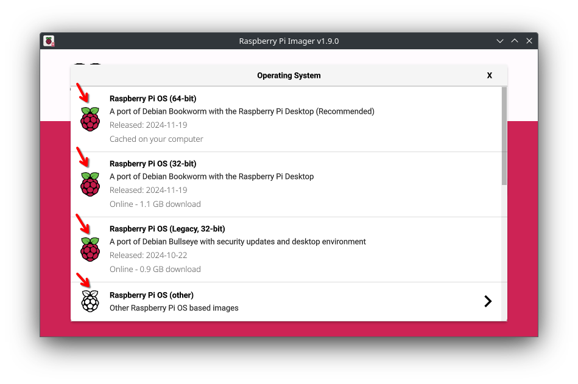
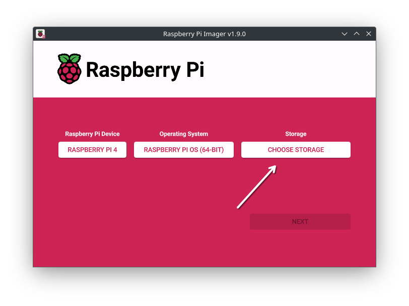

import { Steps } from '@astrojs/starlight/components';

This guide works on any *official* Raspberry Pi. This guide uses the official RPi Imager!

## Requirements
 - a Raspberry Pi
 - a SD Card, USB SSD or Flash Drive (that's where the OS is gonna be installed)
 - (a reading device if needed)
 - Raspberry Pi Imager on a Computer

## Installation
<Steps>
1. Plug in your storage

2. Open RPi Imager

3. Select your Raspberry Pi model
   

4. Select one of the Raspberry Pi OS variants
   
   

5. Select your storage device
   

6. Click next

7. If you want to set predefined settings (keyboard, wifi, ssh, ...), you can edit here. Then just press "yes"
   

8. After the flashing is done, you can start up your Pi, and use the setup wizard, if the OS variant needs it
</Steps>